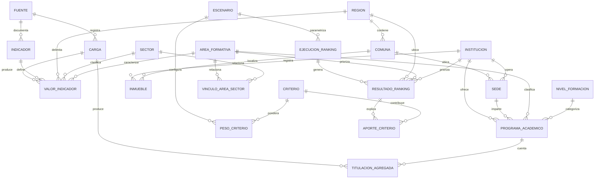
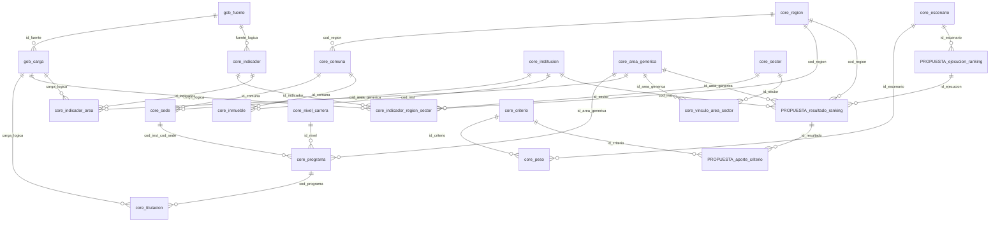
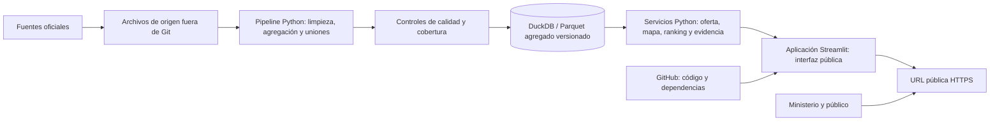
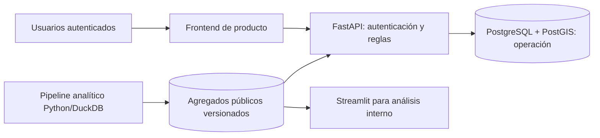

# Diseño de datos y arquitectura de Brújula IA Regional

**Fecha:** 5 de octubre de 2026  
**Estado:** propuesta para revisión del equipo; no sustituye decisiones de producto.  
**Alcance:** herramienta pública de consulta y análisis. No incluye gestión de postulaciones, adjudicación de fondos ni cuentas de empresas/estudiantes.

## Aclaración sobre Streamlit

Correcto: **Streamlit no diseña el MER, el MR ni la arquitectura de datos**. Es una tecnología posible para construir la aplicación de análisis y presentar los resultados en una interfaz web (filtros, tablas, mapas, gráficos, fichas y escenarios).

El diseño conceptual y relacional se define primero a partir de las preguntas del proyecto. Luego se implementan las tablas, el procesamiento de datos y finalmente se elige la interfaz. En este caso el repositorio ya contiene un modelo físico inicial en [db/schema.sql](../db/schema.sql); Streamlit podría consumir sus vistas agregadas, pero no las sustituye.

## 1. Contexto del repositorio y decisión de arquitectura

El proyecto tiene como MVP declarado un ranking de combinaciones región × carrera/área × institución, una visualización territorial y un reporte para el Ministerio. En el repositorio ya existen:

- Esquema DuckDB con catálogos, titulaciones agregadas, indicadores, vínculos área–sector, criterios y escenarios.
- Pipeline Python para construir la base, normalizar y agregar datos, y ejecutar controles de calidad.
- Fuentes de oferta y sedes; las fuentes de demanda laboral, prioridad productiva y exposición/complementariedad con IA todavía requieren validación e ingesta.

**Recomendación:** separar el trabajo en modelo de datos, procesamiento y aplicación. Para una primera versión de acceso público, Streamlit es una opción simple para la **capa de presentación y aplicación analítica**, con DuckDB como almacén local de consulta. No hace falta una API aparte para la primera demo. Si la plataforma adquiere flujos privados o transaccionales, se debe reevaluar la arquitectura.

## 2. MER — Modelo Entidad–Relación conceptual

Este diagrama representa conceptos del dominio, no nombres exactos de tablas físicas.

### Lectura del modelo

- El dato educativo persistente es un **conteo agregado de titulaciones**; la aplicación no necesita ni debe publicar registros personales.
- El vínculo área–sector es muchos a muchos. Debe distinguir vínculos revisados manualmente de sugerencias algorítmicas y de desafíos confirmados por empresas.
- Un indicador debe preservar fuente, periodo, unidad y cobertura. No se debe unir una cifra nacional o de una región con otra de comuna como si tuvieran el mismo grano.
- La tabla `PROGRAMA_ACADEMICO` representa la oferta académica. No equivale al programa público que financiaría tesis: conviene no usar «programa» sin contexto en la interfaz.
- Ejecución y resultados del ranking aparecen como entidades objetivo: todavía no están persistidas en el esquema actual.

## 3. MR — Modelo Relacional

El MR implementado está definido en [db/schema.sql](../db/schema.sql). El diagrama siguiente muestra las relaciones físicas actuales y, con el prefijo `PROPUESTA_`, las tablas nuevas sugeridas para guardar rankings reproducibles.

### Relaciones, claves y granularidad

| Relación | Clave primaria | Claves foráneas y propósito |
|---|---|---|
| `gob.fuente` | `id_fuente` | Catálogo de origen, organismo, URL, licencia y cobertura. |
| `gob.carga` | `id_carga` | `id_fuente`; archivo, hash, periodo, cantidad de filas y fecha de ingesta. |
| `gob.control_calidad` | `regla` | Resultado de reglas de calidad reproducibles. |
| `core.region` | `cod_region` | Catálogo territorial regional. |
| `core.comuna` | `id_comuna` | `cod_region`; código CUT opcional cuando falta en fuente geográfica. |
| `core.institucion` | `cod_inst` | Catálogo de instituciones y tipo. |
| `core.sede` | (`cod_inst`, `cod_sede`) | `cod_inst`, `id_comuna`; el código de sede se usa junto con la institución. |
| `core.inmueble` | `id_inmueble` | `cod_inst`, `id_comuna`; ubicación puntual, latitud/longitud. |
| `core.nivel_carrera` | `id_nivel` | Nivel de formación y elegibilidad de tesis: si/no/pendiente. |
| `core.area_generica` | `id_area_generica` | Clasificación común de áreas de formación. |
| `core.programa` | `cod_programa` | (`cod_inst`, `cod_sede`), `id_nivel`, `id_area_generica`; código y atributos del programa académico SIES. |
| `core.titulacion` | (`periodo`, `cod_programa`, `genero`) | Conteo `n_titulos`; `id_carga` tiene referencia lógica a `gob.carga`. |
| `core.sector` | `id_sector` | Catálogo sectorial; único por clasificación y código. |
| `core.indicador` | `id_indicador` | Definición, unidad, naturaleza de evidencia y referencia lógica a fuente. |
| `core.indicador_region_sector` | (`id_indicador`, `cod_region`, `id_sector`, `periodo`) | Valor medido a grano región–sector–periodo; carga lógica. |
| `core.indicador_area` | (`id_indicador`, `id_area_generica`) | Valor asociado a área; actualmente no contiene periodo. |
| `core.vinculo_area_sector` | (`id_area_generica`, `id_sector`) | Puntaje, método, estado y justificación del vínculo. |
| `core.criterio` | `id_criterio` | Criterio, definición y sentido de preferencia. |
| `core.escenario` | `id_escenario` | Configuración nominal para comparar supuestos. |
| `core.peso` | (`id_escenario`, `id_criterio`) | Peso del criterio; la suma a 1 se debe comprobar fuera de la restricción individual. |
| `PROPUESTA_ejecucion_ranking` | `id_ejecucion` | Nueva: escenario, fecha, versión de datos/algoritmo y parámetros usados. |
| `PROPUESTA_resultado_ranking` | `id_resultado` | Nueva: ejecución, región, área, institución, puesto y puntaje; único por combinación dentro de una ejecución. |
| `PROPUESTA_aporte_criterio` | (`id_resultado`, `id_criterio`) | Nueva: valor fuente, valor normalizado, peso aplicado y contribución al puntaje. |

### Brechas del esquema físico actual

1. `core.escenario` y `core.peso` guardan escenarios, pero el esquema no persiste una ejecución del cálculo ni su resultado. Para explicar y reconstruir rankings históricos, añadir las tres relaciones marcadas como propuesta, con snapshot de pesos, datos y versión del algoritmo.
2. DuckDB no declara aquí todas las relaciones FK entre esquemas `core` y `gob`; el propio `schema.sql` señala que esas referencias lógicas deben comprobarse mediante controles de calidad.
3. `core.indicador_area` no incluye periodo. Confirmar si todos sus valores serán atemporales; de lo contrario, agregar periodo/versionado antes de cargar fuentes.
4. `core.vinculo_area_sector` solo admite una fila por área y sector. Si se deben guardar revisiones o varios modelos, usar identificador de vínculo e historial en vez de sobrescribir el dato.
5. El esquema contiene coordenadas puntuales de inmuebles, pero no polígonos de región/comuna. Un mapa de sedes funciona con puntos; un coroplético requiere agregar geometrías y documentar fuente/licencia.
6. El repositorio todavía no integra evidencia verificada de demanda laboral, vocación productiva o exposición a IA. No activar esos factores del ranking hasta validar fuentes, periodo y unidad geográfica.

## 4. Arquitectura de la plataforma

### 4.1 MVP: capas separadas y Streamlit solo en la capa de aplicación

**Responsabilidad de cada pieza**

- **MER/MR:** definen conceptos, relaciones, claves y granularidad. No dependen de Streamlit.
- **Pipeline:** descarga o recibe las fuentes, transforma los datos y genera agregados; nunca se ejecuta sobre microdatos en cada visita a la web.
- **DuckDB/Parquet:** almacena resultados ya procesados para consultas analíticas.
- **Servicios Python:** aplican filtros y reglas de ranking; quedan separados de la interfaz para poder probar el cálculo.
- **Streamlit:** construye las páginas y controles para presentar/interactuar con los resultados. Para el MVP público se recomienda una app con vistas de oferta, mapa, ranking, escenarios y ficha de evidencia.
- **Publicación:** despliegue desde GitHub a Streamlit Community Cloud u otro hosting Python. La visibilidad pública se configura en el servicio; el enlace queda accesible sin pedir cuentas a quienes consultan.

No recomiendo incorporar FastAPI en la primera versión si la única consumidora es la misma app Streamlit. Se puede añadir después si otra aplicación necesita consumir los datos como API.

### 4.2 Despliegue público y cuidado de datos

Streamlit Community Cloud permite compartir la app mediante URL y configurar la visibilidad pública o privada según su documentación. Para este producto, publicar solo indicadores agregados y fuentes redistribuibles. La app pública debe considerarse una publicación abierta: no incluir registros personales, secretos ni archivos brutos.

- El CSV de titulados contiene campos personales en origen. No debe entrar al repositorio público, artefacto web, API, logs de UI ni reporte. Persistir únicamente los agregados necesarios, como ya propone `construir_bd.py`.
- Comprobar el tamaño de DuckDB/Parquet agregado antes de subirlo. Si no conviene versionarlo en Git, publicarlo como artefacto versionado con checksum y fijar la versión que carga la app.
- Definir con el equipo si se suprimen o agrupan celdas con pocos casos para reducir riesgo de inferencia; no asumir un umbral sin analizarlo.
- Mostrar fuente, fecha, cobertura, datos faltantes y limitaciones al lado de cada indicador.
- Si aparecen datos confidenciales de empresas, estudiantes o postulaciones, no usar el flujo público descrito: requerirá autenticación, autorización y almacenamiento separado.

### 4.3 Evolución solo si hay usuarios/transacciones privadas

Esto sería apropiado si el alcance pasa de consultar recomendaciones a crear retos privados, recibir postulaciones, coordinar tutores o administrar fondos. Es una posible evolución; no hace falta implementarla para el MVP de análisis.

## 5. Recomendación concreta

1. Confirmar con el equipo la unidad exacta del ranking: el README plantea región × carrera/área × institución, mientras otra historia propone carrera × sector dentro de una región piloto.
2. Acordar los niveles de formación que se incluyen y cómo se trata modalidad no presencial.
3. Validar fuentes de demanda, sectores estratégicos y complementariedad con IA; el stack no resuelve esa brecha de evidencia.
4. Mantener DuckDB y el pipeline como capa de datos existente; agregar persistencia/versionado de ejecuciones del ranking si se necesita reproducibilidad histórica.
5. Construir Streamlit después de estabilizar las salidas analíticas: su función será **construir la app de consulta y presentar datos**, no diseñar el modelo de datos.
6. Probar la aplicación desde una sesión anónima y verificar que sus tablas, gráficos, descargas y logs no expongan microdatos.

### Conclusión

Tu distinción es correcta: **Streamlit sirve para construir la app de datos y mostrar los resultados; no para diseñar el MER/MR**. Para el MVP propuesto es adecuado como interfaz pública simple. El modelado se apoya en los requisitos y en el esquema DuckDB que ya existe; las brechas principales son los datos externos y la trazabilidad persistente de cada ranking.

**Referencias oficiales de despliegue:** [Streamlit Community Cloud](https://docs.streamlit.io/deploy/streamlit-community-cloud/deploy-your-app) · [Compartir y definir visibilidad](https://docs.streamlit.io/deploy/streamlit-community-cloud/share-your-app).
